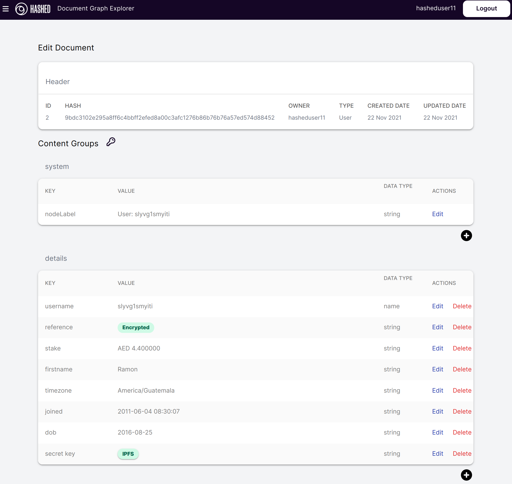

# Introduction

Document Graph is a flexible persistence and modeling framework for blockchain applications.

# Overview

1. Document is a node in the graph. Documents have a:
    - ID (system assigned & immutable)
    - Label
    - Owner (could be owned by a DAO)
    - Content
        - Text or Primitive type data (e.g. % interest or 2.50 USD)
        - Files, photos, videos, saved into IPFS with the CID saved in the document.
        - Any content can be optionally encrypted with a password that can be shared through a side channel.

2. Edges connect nodes. Each edge has:
    - From Node
    - To Node
    - Edge Name (type: `eosio::name`)
    - Owner

3. Only the owner can edit a document or an edge (e.g. only `dao.hypha` can edit a document created by the DHO)

4. Anyone can extend an existing graph with documents that they are the `owner` of. This allows for multitenant control over different data in the same graph. 

5. Document Graph includes a web-based Explorer and Editor that allows non-technical users to directly `create`, `edit`, `erase`, and `extend`. Screenshot shows `edit` screen where user has encrypted the `reference` field and saved the `secret key` to IPFS.  **(not recommended, this was just to illustrate the functionality)**

6. Actions can be deployed anywhere on the layer 1 to interact with the graph. The code in those contracts will modify the graph contents, but will require the permission of the `owner` that created it. The default contract has all of the basic actions (e.g. trigger a proposal if the right DAO/DHO/owner for edits). But it is compatible with any contracts on the layer 1, so it allows for trustless deployment of business logic that scales to the bounds of the layer 1. 

## Example Graph
- member is a member of two organizations
- badges are owned by the Badge Librarian
- members are assigned badges
- member has been paid multiple times

