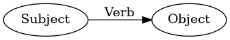
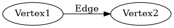
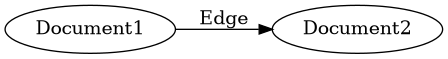
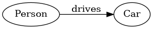

# Semantic Triples
Databases typically store data in a tabular format, where a table has set of columns and rows, like a spreadsheet.

However, IRL, we tend to think in statements of ```Subject```, ```Predicate``` (```Verb```), and ```Object```. This is particularly true in the English language where word order is subject, verb, object (SVO). This information construct is known as ```triples```, or [semantic triples](https://en.wikipedia.org/wiki/Semantic_triple). The [W3C Resource Description Framework](https://www.w3.org/RDF/) is a leading specification for organizing these statements into semantic triples. 

As Lenhert describes [here](https://www.synaptica.com/triples-triads-and-semantics/): 

> "One of the fundamental benefits of these RDF-based controlled vocabulary structures are their dual nature as being both human intelligible as well as machine readable (and, therefore, portable). Like their basic constituent subject-verb-object basis, ontologies convey rich meaning in relatively simple and compact statements, making them extremely useful in modeling complex knowledge environments."

The following diagrams express semantic triples in various terms.
### Using the natural English [SOV](https://en.wikipedia.org/wiki/Subject%E2%80%93verb%E2%80%93object) terms


### Using common [graph theory](https://en.wikipedia.org/wiki/Vertex_(graph_theory)) terms


### Using the Document Graph terms

Note that edges are both directional and labeled.


### Simple Example of a Semantic Triple
