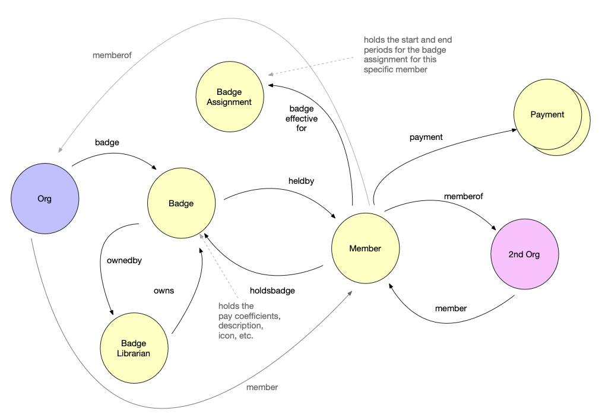

# Use Cases

Document Graph is currently used for a number of use cases. Here are some real-world examples that we are using it for. Interestingly, all of the below use cases can be handled within the same graph where nodes can be linked to each other across contexts.

### DAOs
DAOs have have descriptive attributes. They also have members, proposals, assignments, quests, bounties, badges, and many other data types that are maintained to support a fully functional platform. 

Here's an actual example of how Document Graph is used to manage a few components within a DAO's information space. 



### Supply Chain
We use Document Graph for a supply chain traceability application. An ```Item``` and its various ```Checkpoints``` are saved as ```documents```. When a new QR code ```scan``` event occurs, it extends the graph for that item to contain a new ```Checkpoint```.  

Since a ```Checkpoint``` is a document, it can store any arbitrary data that describes that event, such as weight, longitude, latitude, cost, and even photos or other files such as packing lists. Files are stored in IPFS and anchored into the on-chain document. 

Users have the option to save data directly onto the chain (for access within smart contracts) or to save the data to IPFS. Users also have the option to encrypt the data with a password of their choice.


### Accounting
We also use the Document Graph to store data required to operate a double-entry accounting system. This system allows users to generate classical accounting reports such as Balance Sheet and Income Statement from blockchain transactions.

Accountants must be able to tag transactions with additional data, references, files, etc., and they must also be able to assign a general ledger account to appropriately calculate debits and credits.