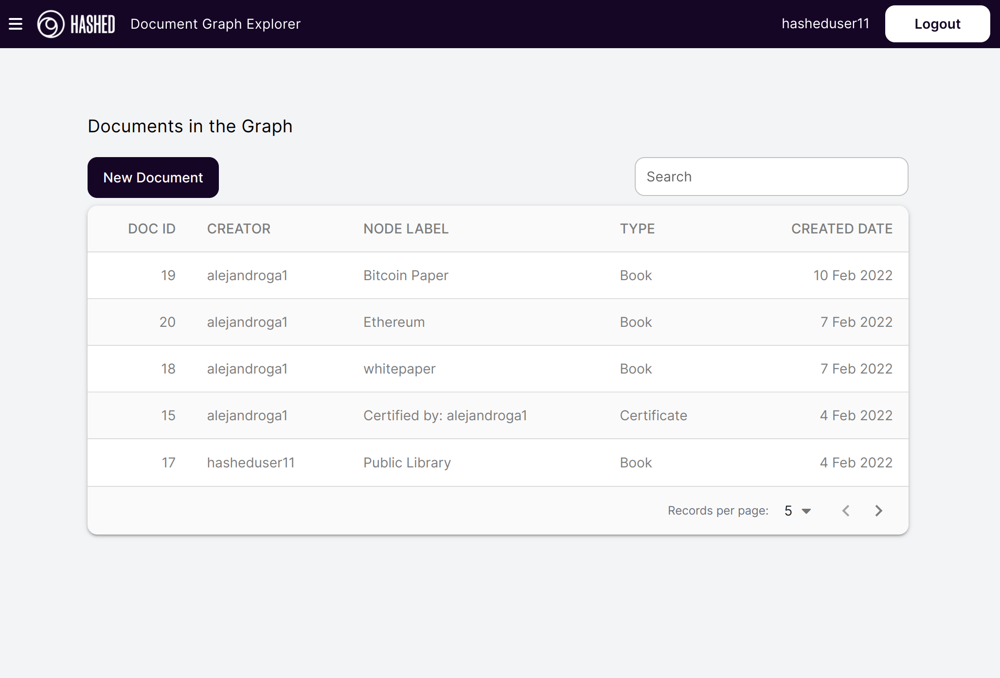
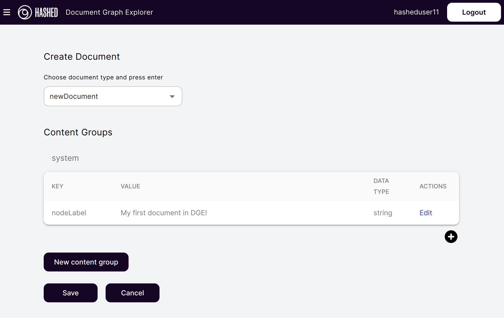
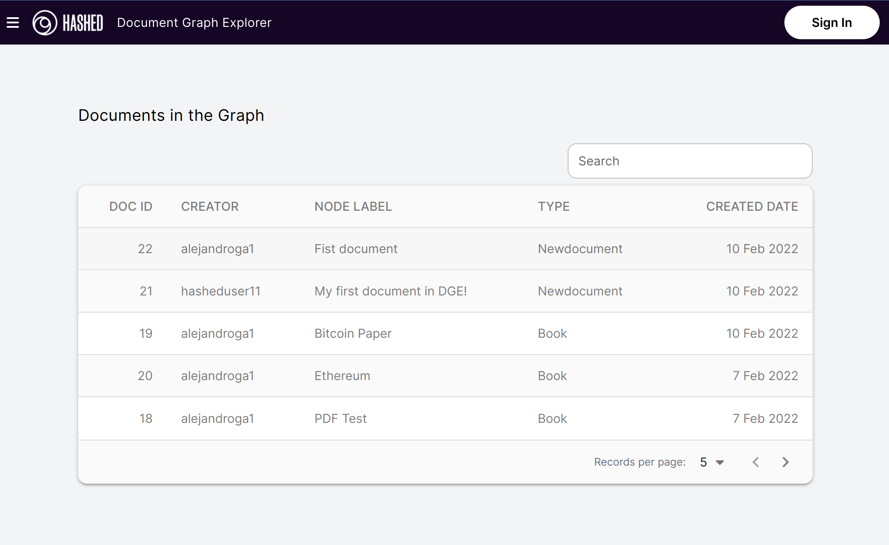

# Getting Started
> ## Prerequisites
> [Readme](https://dge.hashed.systems/explore?document_id=0&endpoint=https%3A%2F%2Fhashed.systems%2Falpha-dg-mainnet%2Fgraphql)
>
> *This apply for the following actions:*
> *Create, Edit, Delete, Extend,Certify [^note]*
>
> * A Telos account
> * [Anchor](https://greymass.com/en/anchor/)  wallet installed
>
[^note] You do not need the prerequisite to navigate through the Graph
## Features
* Read document 
* Create document
* Extend document
* Delete document
* Certify document
* Navigation through URL
* Custom GraphQL endpoints
* Elastic Search Support
* Save content in IPFS
* Encrypt data
## How to create a document
The Document Graph Explorer allows the creation of new documents for any user. For that, you need to click on the button New document

Then the only thing that you need to do is fill out the form and click on the Save button. The image below show the simplest document that you can create, only need a name and node label.

After the save document, the data will be updated after the finalized block and one time that the other tool catches the changes into the blockchain you will see your first document.

