# Tutorials

### Step by step walkthroughs 
    - How to create a document
    - How to edit a document
    - How to extend the graph
    - How to erase a document or edge

### Advanced topics
    - Using IPFS to mask content that should not be immutable
    - Using the markdown editor
    - Encryption
    - Searching contents of linked IPFS documents

## Create your first document

Once you finish the steps of getting started, you should be able to create your first document, and here we are going to explain how to do it.

### Before you start

You can access the Document Graph Explorer on any of these endpoints

- [Hashed System](https://dge.hashed.systems/)
- [Telos Kitchen](https://dge.telos.kitchen/)

Make sure you have a TELOS account and Anchor wallet up and running!

### Now it's time!

When you open one of the Document Graph Explorer you'll see something like this:

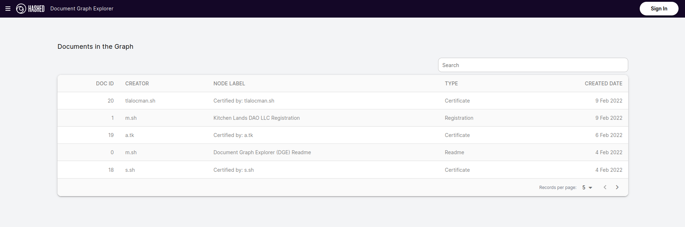

What you are seeing is the general view of all documents stored at the Document Graph, feel free to play with it and navigate in all the documents and edges.

Anyway, once you played a bit with it it's time to write your own document!

To do that, you'll need to press the Sign in button in the top right corner. Once you pressed it you'll prompt to an anchor 

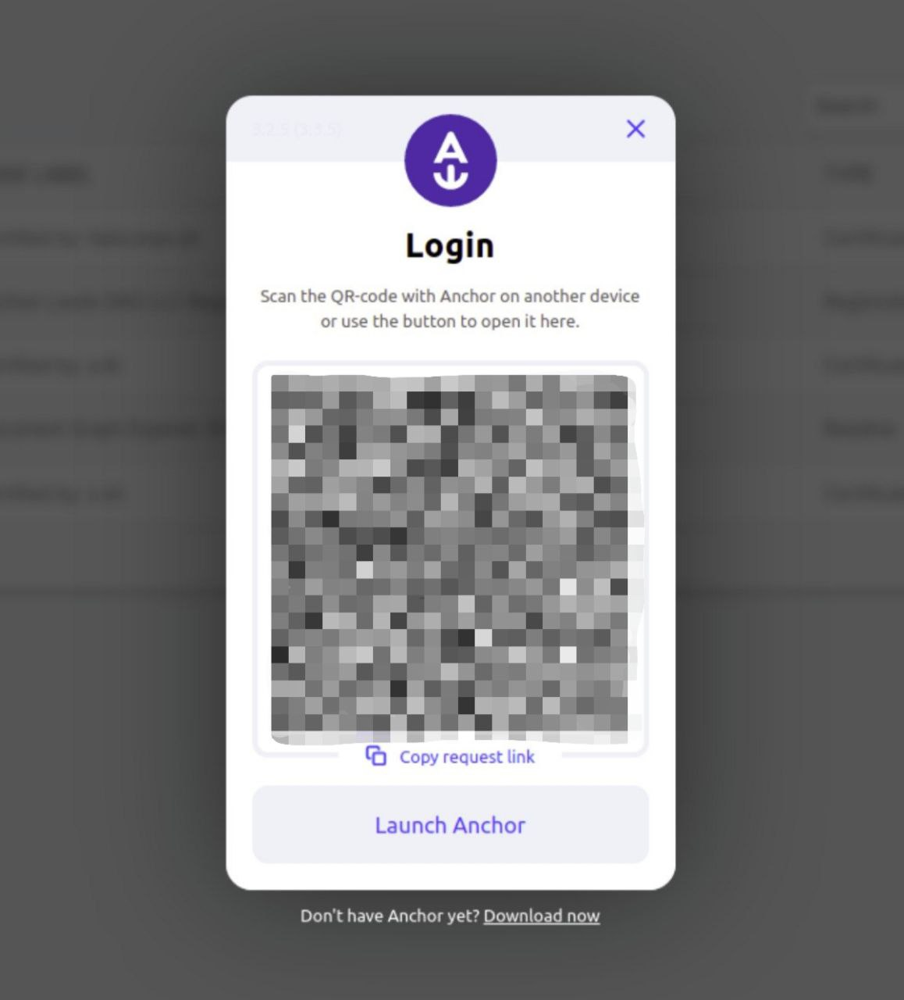

Accept the identity authority to access all options in the Document Graph Explorer.

The steps to create a document are very straightforward, go ahead and press new the buttom that says **New Document**

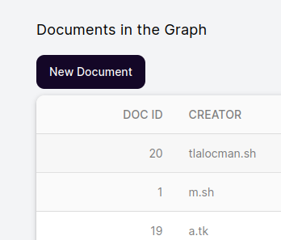

Once you press it, you'll get a menu that looks pretty much like this

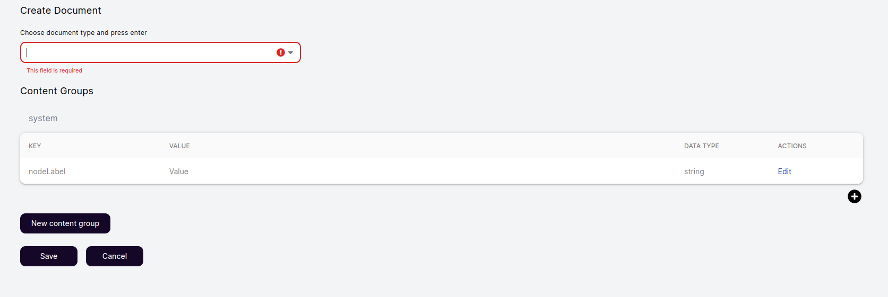

In that screen you can see the following information:
 - document type
 - content groups
 - node label
 - contents

Each concept can be described as follows

| Concept | Description |
| ----------- | ----------- |
| document type | Document types makes refers as a template of documents, it can be as Book, User. You can type your own **just make sure it's not longer that 12 characters** |
| content groups | A content group is the core of the document, it can store as many contents (node labels) as you wish, and the document can store several content groups. Basically you can create and divide your document in different sections | 
| node label | Node label is the main title of your document. |
| contents | Contents are pairs of data types and values stored by a key. As an example, imagine you want to store the title of a book, the key could be __title__, the value should be the book title (as an example: __Der Steppenwolf__) and the data type a __String__.| 

Now that is settle, let's continue with our document

### Letter to Santa Claus

Lets make our first document be a letter to Santa Claus.

To do that, you should be at the create document screen, 

1. Write in the document type __letter__ and press enter.
2. Press the edit button on the __nodeLabel__ key.
3. Change __Value__ to __Letter from__ and your name.

you should get something like this.

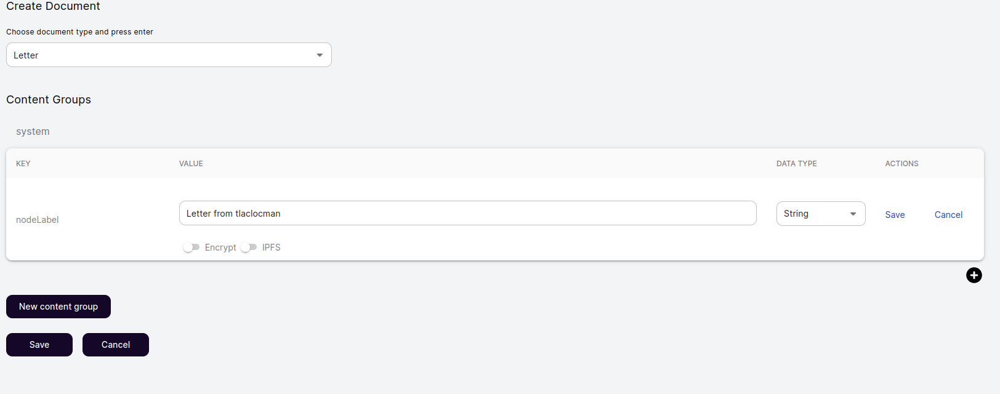

Then press the buttom __New content group__ and name it as __body__

Once you made that, go ahead and add a new content for the new content group, write in the key __salutation__ and in the value __Dear santa,__.
Make sure the data type is String and click save.

Now lets create a new content called __main.body__ and in the value write your letter.

At the end you should have something like this:

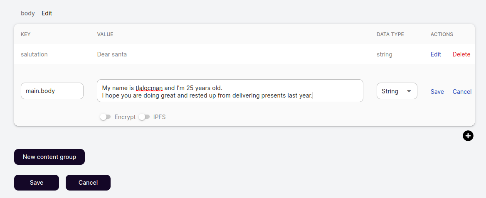

To conclude push the save buttom in the bottom left corner and sign the transaction with your wallet.

Congratulations! You just made your first document!

Also, you may not see your document as soon as you press the save button, its a small delay between the buttom press and the block validation of the blockchain, so be patient!

## Edit a document

Oh wait! It looks like we miss some information on the letter! We forgot to write the destination!

Let's use the search bar to find our document, just type __letter from__ and your name to find it.
Once you found it, click it (log in if you have not done it yet) and press the **edit** buttom on the bottom of the page

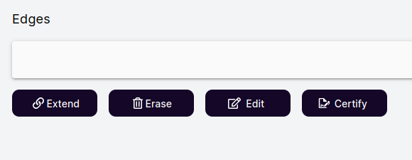

It only will show up if you are the creator of the document and you are logged in.

Now lets make a new content group called __inside_address__

Then create a content called __recipient__ and write __Santa Claus__ in the value.

Create one last content called __address__ and write __North Pole__.

You should have something like this

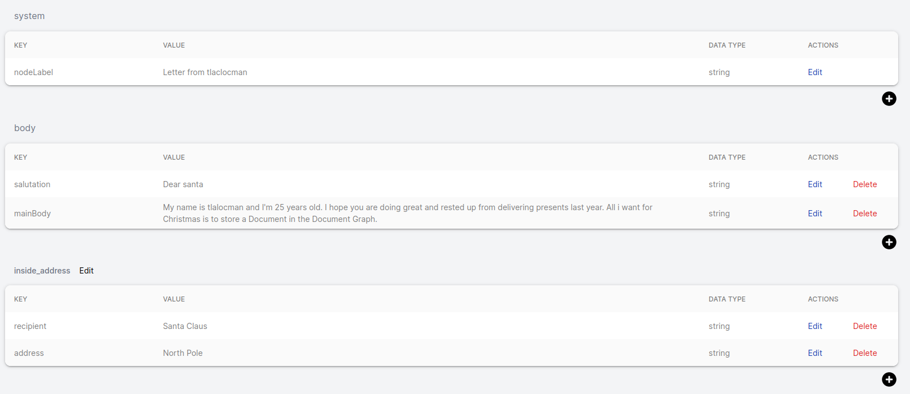

To save it, press the save buttom and sign the transaction with your anchor wallet.

We did it! Now we edited our first document!

## Extend the graph

Now its time to extend the graph 

Lets use the letter we made previously.

Search for it on the search bar and open the document, you shall see a buttom called extend.

Go ahead and press it. Now you should see a similar page of create a new document but with a new component that says __Edge Name__

What extend does is create a new document with and edge pointing to the previous document, Document Graph is based on nodes (Documents) and edges, that's why it's called Document Graph.

So, let's write our first edge, calling it as __extras__.

When you write an edge name, be careful of only using 12 characters or less.

Now edit the nodeLabel value to be __Extra information__.

Remember that nodeLabel is the title of the document.

After you completed the steps above, make a new content group called __details__, there you'll be storing the following information, use the data type String for all of them.

| Key | Value |
| ----------- | ----------- |
| transporter   | Rudolph the Red-Nosed Reindeer Inc. |
| status  |  Shipment is out with courier for delivery | 
| id  | TzKlm258105w60280de35 |

You should end with something pretty much like this:

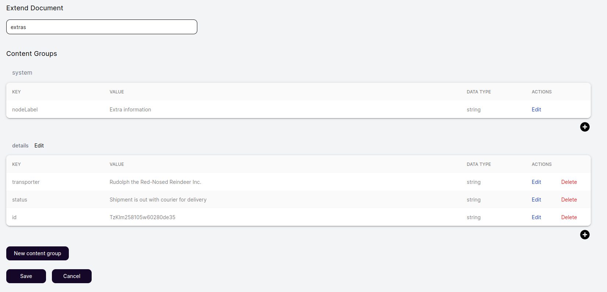

Click save and sign the transaction - Congrats! Now you have another document and it has a relation with the previous one.

## Erase a document or edge

To erase a document is straightforward.

You'll need to navigate to a document you created, then press the button erase.

A pop up should appear.

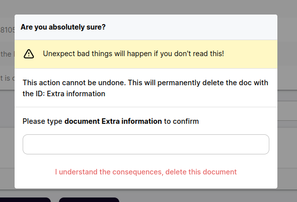

In the example it ask to write __document Extra information__ in the white box below, it may vary depending on your document name. 

Once you write the needed information you can delete the document. 

THIS WILL PERMANENTLY DELETE THE DOCUMENT AND IT CANNOT BE UNDONE.

# Advanced topics

Congratulations! If you are reading this part is because you are an expert creating documents on Document Graph Explorer (DGE). So now lets talk about the more advance topics that DGE offers.

## Using IPFS to mask content that should not be immutable.

The very first one is using it to store the information in IPFS, that way the content stays the same as it is hashed with an unique CID and is immutable as long as the document points to the same CID.

To make that possible lets go to the old document we made (or feel free to create a new one)

If you want to implement this feature on your document, you need to edit or create a new content. Below it will appear a toggle buttom that says IPFS

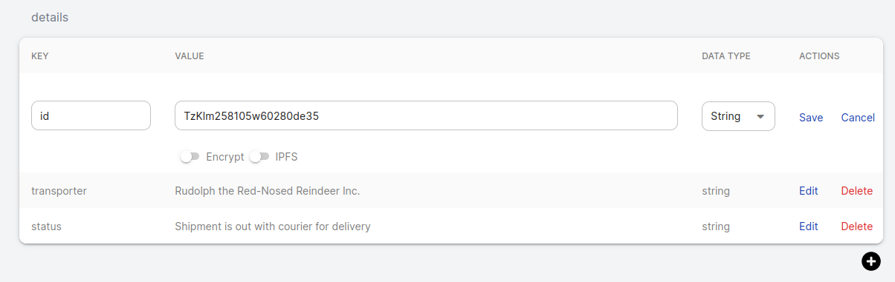

Once you press that buttom, click save and now it will appear as a __FILE__, press it to see it's content!

Now you know how to store content as IPFS

## Using the markdown editor

You may find a little plain to write your documents without a way to create content with custom views of it. 

Good news! Document Graph Explorer renders contents wrote with Markdown, and its way to simple to use this feature, in your document, just create a new content and write it as you were writing any markdown document.

You can see a [markdown cheat sheet](https://www.markdownguide.org/cheat-sheet) if you need some examples.

PS. It may not render all of the elements and LaTex is not supported.

## Encryption

Imagine you want to store something that's private and you don't want everybody to reads that. For that reason DGE offers a way to encrypt your data. With DGE you can encrypt your data with an advance encryption standard: AES-256 symmetric, that is virtually impenetrable using brute-force methods.

It sounds pretty cool, right? To do that you need to edit or create a new content. Imagine the example of extend document when we wrote the id of the card we are sending to Santa, we don't really want to show that to the world, so lets encrypt that content!

Navigate to your document using the search bar and log in with your account. Once it's done you can press the edit buttton on the bottom of the page. After that press the edit buttom next to the content you want to edit.

It should look like this:

You can see two toggle button one for IPFS and other to encrypt your data. Press the one that says Encrypt.
Once you’ve selected the option, a Pop up will appear. 

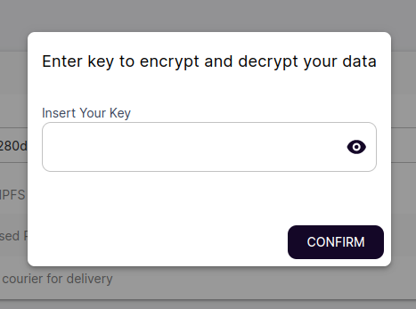

Next you need to provide a seed to encrypt and decrypt your data, see it as a key that would open or close the content. That key would not be stored in any place, so make sure you store it in a save place you'll remember, because once the content is encrypted it cannot be decrypted without that key!

Click Confirm. Now your content is encrypted and only you can decrypt it! You can also share the key to other people if you want them to see the content.

## Searching contents of linked IPFS documents

If you are an IPFS expert or enthusiast, you may want to store a very large file. In DGE you cant point a CID in the content to point to a file stored in IPFS. Imagine you have uploaded a book or a video and you want to include it in your document.

To upload it you can use of the many IPFS node distributors that exists. Or if you have already your CID you can store it as `ipfs://CID` and it automatically point to that content when you press the new FILE button that will appear once you save it.