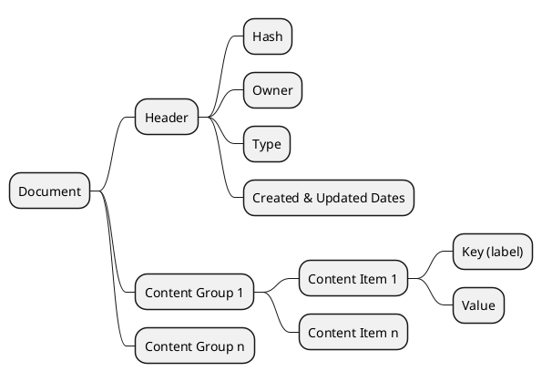

## Document Data Model



Each document is comprised of the following:

- Header 
    - [required] creator (account)
    - [required] graph contract (where the document is saved)
    - [optional] created date (timepoint)
    - [optional] updated date (timepoint)
    - [optional] hash of content (not including certificates or header)
- Content
    - Value (variant) = ```std::variant <asset, string, time_point, name, int64> ```
    - Content = an optionally labeled FlexValue
    - Content Group = vector<Content>
    - Content Groups = vector<ContentGroup>
    - Each document contains a single instance of ContentGroups.
    - This provides enough flexibility to support: 
        - data of all supported types,
        - short clauses of annotated text,
        - longer form sequenced data, e.g. chapters. 
- Certificates [optional]
    - Each document has ```O..n``` certificates.
    - Certificate 
        - certifier: the 'signer' 
        - notes: string data provided by signer
        - certification_date: time_point    