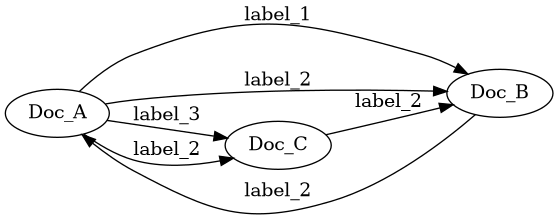

# Graph
### Graph composed of Nodes and Edges

A Document Graph is a set of documents that are connected with 0..n labeled, directional edges.

### Specification
- A document may have many edges with the same label.
- A document may link to another document many times.
- Edges that connect the same documents in the same direction must have unique labels.

